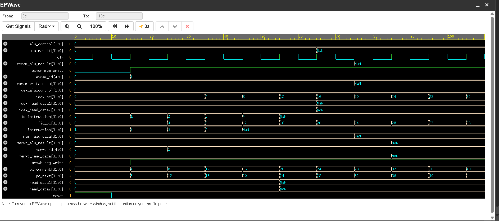
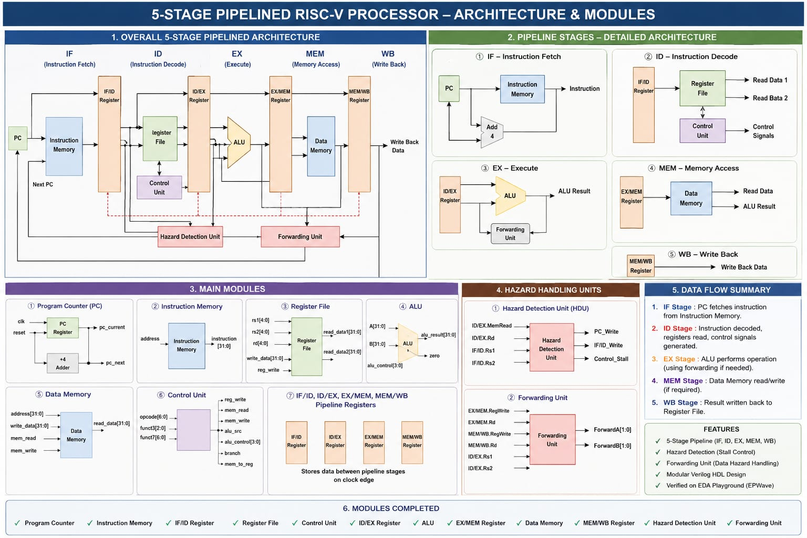

# 5-Stage Pipelined RISC-V Processor

A complete 5-stage pipelined RISC-V processor designed and implemented using Verilog HDL. The project demonstrates instruction pipelining, hazard detection, and data forwarding mechanisms to improve processor performance and execution efficiency.

---

# Project Overview

This project implements a simplified RISC-V processor architecture with five pipeline stages:

1. IF  - Instruction Fetch
2. ID  - Instruction Decode
3. EX  - Execute
4. MEM - Memory Access
5. WB  - Write Back

The processor is fully modular and includes important pipeline optimization techniques such as:

- Hazard Detection Unit (HDU)
- Forwarding Unit
- Pipeline Registers
- ALU Operations
- Register File
- Instruction and Data Memory

The entire processor was simulated and verified using EDA Playground and EPWave waveform analysis.

---

# Features

## Processor Features

- 5-stage pipelined RISC-V architecture
- Modular Verilog HDL design
- Instruction Fetch and Decode stages
- ALU-based Execute stage
- Data Memory operations
- Register Write-Back mechanism

## Pipeline Registers

- IF/ID Register
- ID/EX Register
- EX/MEM Register
- MEM/WB Register

## Hazard Handling

- Hazard Detection Unit for pipeline stalls
- Forwarding Unit for data hazard resolution
- Reduced pipeline delays
- Improved execution efficiency

## Verification Features

- Complete waveform verification
- EPWave simulation analysis
- Pipeline signal monitoring
- Instruction propagation verification

---

# Processor Architecture

The processor architecture consists of the following major modules:

|  **Module**              | **Function**                            |
| Program Counter (PC)     | Maintains instruction address           |
| Instruction Memory       | Stores processor instructions           |
| IF/ID Register           | Transfers IF stage data                 |
| Register File            | Stores general-purpose registers        |
| Control Unit             | Generates control signals               |
| ID/EX Register           | Transfers decode stage data             |
| ALU                      | Performs arithmetic/logical operations  |
| EX/MEM Register          | Transfers execute stage data            |
| Data Memory              | Handles load/store operations           |
| MEM/WB Register          | Transfers memory results                |
| Hazard Detection Unit    | Detects pipeline hazards                |
| Forwarding Unit          | Resolves data dependencies              |

### Processor Architecture Flow:  

                    ┌─────────────────────┐
                    │   Program Counter   │
                    │        (PC)         │
                    └─────────┬───────────┘
                              │
                              ▼
                    ┌─────────────────────┐
                    │ Instruction Memory  │
                    └─────────┬───────────┘
                              │
                              ▼
                    ┌─────────────────────┐
                    │    IF/ID Register   │
                    └─────────┬───────────┘
                              │
                              ▼
                    ┌─────────────────────┐
                    │    Register File    │
                    └─────────┬───────────┘
                              │
                              ▼
                    ┌─────────────────────┐
                    │    Control Unit     │
                    └─────────┬───────────┘
                              │
                              ▼
                    ┌─────────────────────┐
                    │    Hazard Detection │
                    │        Unit         │
                    └─────────┬───────────┘
                              │
                              ▼
                    ┌─────────────────────┐
                    │    ID/EX Register   │
                    └─────────┬───────────┘
                              │
                              ▼
                    ┌─────────────────────┐
                    │         ALU         │
                    └─────────┬───────────┘
                              │
                              ▼
                    ┌─────────────────────┐
                    │   Forwarding Unit   │
                    └─────────┬───────────┘
                              │
                              ▼
                    ┌─────────────────────┐
                    │    EX/MEM Register  │
                    └─────────┬───────────┘
                              │
                              ▼
                    ┌─────────────────────┐
                    │     Data Memory     │
                    └─────────┬───────────┘
                              │
                              ▼
                    ┌─────────────────────┐
                    │    MEM/WB Register  │
                    └─────────┬───────────┘
                              │
                              ▼
                    ┌─────────────────────┐
                    │     Write Back      │
                    └─────────────────────┘

---

# Pipeline Stages

## 1. Instruction Fetch (IF)

- Fetches instructions from instruction memory
- Updates Program Counter
- Sends instruction to IF/ID register

## 2. Instruction Decode (ID)

- Decodes instruction opcode
- Reads register operands
- Generates control signals

## 3. Execute (EX)

- Performs ALU operations
- Executes arithmetic and logical instructions
- Handles forwarding logic

## 4. Memory Access (MEM)

- Performs memory read/write operations
- Handles load and store instructions

## 5. Write Back (WB)

- Writes ALU or memory result back to Register File

### Pipeline Flow:

     IF  →  ID  →  EX  →  MEM  →  WB

    Fetch → Decode → Execute → Memory → Write Back

### Implemented Pipleline Registers:

    IF/ID   → Between Fetch and Decode
    ID/EX   → Between Decode and Execute
    EX/MEM  → Between Execute and Memory
    MEM/WB  → Between Memory and Write Back    

---

# Hazard Detection and Forwarding

## Hazard Detection Unit

The Hazard Detection Unit identifies data hazards occurring during instruction execution and stalls the pipeline whenever necessary to prevent incorrect execution.

### Verified Operations
- Load-use hazard detection
- Pipeline stalling
- Program Counter freeze
- IF/ID register control

### Hazard Handling Architecture:

                 ┌──────────────────┐
                 │ Hazard Detection │
                 │       Unit       │
                 └────────┬─────────┘
                          │
                     Generates
                        Stall
                          │
                          ▼
                    Pipeline Control

---

## Forwarding Unit

The Forwarding Unit minimizes unnecessary stalls by forwarding ALU results directly between pipeline stages.

### Verified Operations
- EX/MEM forwarding
- MEM/WB forwarding
- Operand forwarding
- Data dependency resolution

### Forwarding Architecture:
                     
             ┌────────────────────┐
             │  Forwarding Unit   │
             └─────────┬──────────┘
                       │
         ┌─────────────┴─────────────┐
         │                           │
         ▼                           ▼
   EX/MEM Result              MEM/WB Result
         │                           │
         └────────► ALU Inputs ◄─────┘

---

# Verification and Simulation

The processor was successfully verified using waveform simulation tools.

## Simulation Tools

- EDA Playground
- Icarus Verilog
- EPWave

## Verification Steps

1. Designed and verified individual modules
2. Connected all pipeline stages
3. Integrated hazard detection logic
4. Integrated forwarding logic
5. Simulated processor using testbench
6. Verified waveform outputs
7. Checked instruction propagation
8. Verified hazard handling

---

# Observed Signals

The following signals were monitored during simulation:

- pc_current
- pc_next
- instruction
- ifid_instruction
- idex_read_data1
- idex_read_data2
- alu_result
- memwb_read_data
- stall
- forwardA
- forwardB

---

# Screenshots

## EPWave Simulation

## Processor Architecture

## Hazard Detection Verification

The waveform demonstrates successful execution of the 5-stage pipelined RISC-V processor with proper instruction propagation across the IF, ID, EX, MEM, and WB stages. The simulation verifies correct pipeline register operation, ALU execution, memory stage functionality, and synchronized data flow using EPWave. Since the provided instruction sequence does not contain data dependencies, no pipeline stalls were generated during this simulation.

---

# Project Folder Structure

RISCV_PROJECT/
│
├── rtl/
│   ├── alu.v
│   ├── pc.v
│   ├── instruction_memory.v
│   ├── register_file.v
│   ├── control_unit.v
│   └── processor.v
│
├── testbench/
│   ├── alu_tb.v
│   ├── pc_tb.v
│   ├── instruction_memory_tb.v
│   ├── register_file_tb.v
│   ├── control_unit_tb.v
│   └── processor_tb.v
|
├── docs/
│   ├── architecture.md
│   ├── module_explanation.md
│   └── verification.md
│
├── images/
|
├── screenshots/
│
├── waveforms/
│
└── README.md